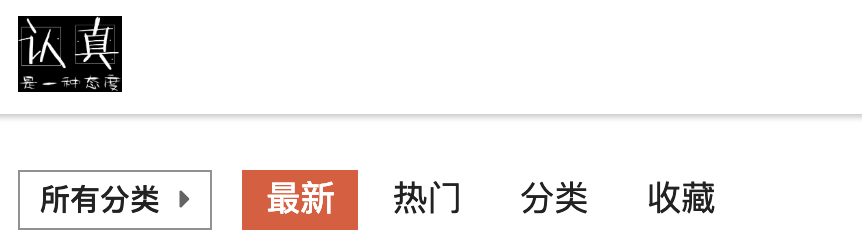
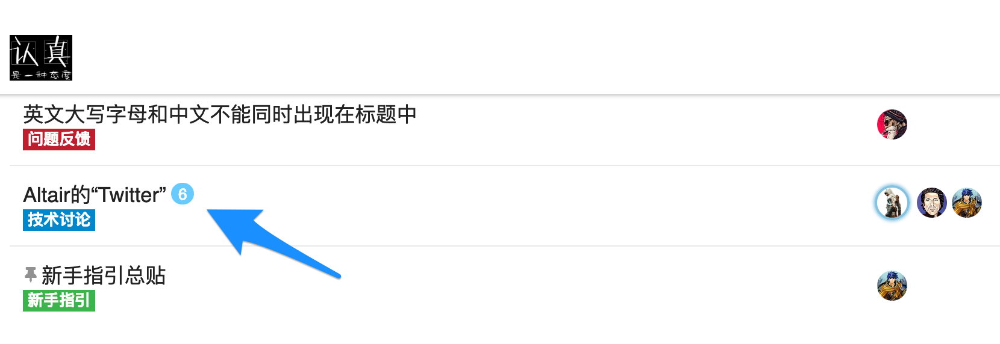
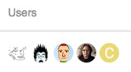
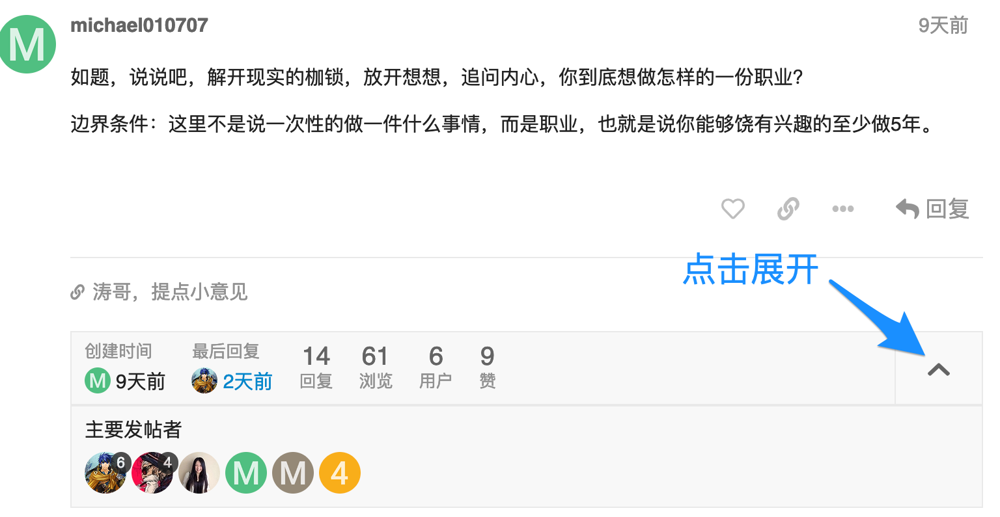
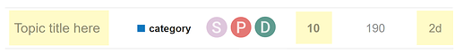
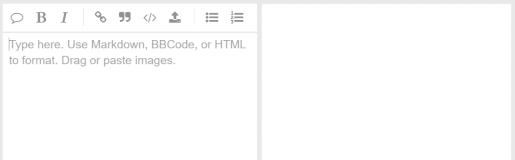
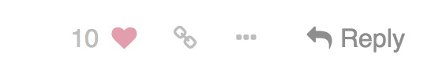

# Discourse New User Guide

Welcome! As a new user of Discourse, we hope you will find this site intuitive and clearly structured, but here is some guidance to get you started:

1. [Basic Terms Used by Discourse](https://meta.discourse.org/t/discourse-new-user-guide/96331#heading--terms)
2. [Browsing the Forum](https://meta.discourse.org/t/discourse-new-user-guide/96331#heading--browsing)
    * [Topic lists](https://meta.discourse.org/t/discourse-new-user-guide/96331#heading--topic)
    * [See who is participating](https://meta.discourse.org/t/discourse-new-user-guide/96331#heading--see)
3. [Navigation Tools](https://meta.discourse.org/t/discourse-new-user-guide/96331#heading--navigation)
4. [Reading Topics](https://meta.discourse.org/t/discourse-new-user-guide/96331#heading--reading)
    * [Keep scrolling](https://meta.discourse.org/t/discourse-new-user-guide/96331#heading--scrolling)
    * [Jump back in](https://meta.discourse.org/t/discourse-new-user-guide/96331#heading--jump)
    * [Related topics](https://meta.discourse.org/t/discourse-new-user-guide/96331#heading--related)
5. [Taking Part in Conversations](https://meta.discourse.org/t/discourse-new-user-guide/96331#heading--convo)
    * [Replying](https://meta.discourse.org/t/discourse-new-user-guide/96331#heading--reply)
    * [Drafts](https://meta.discourse.org/t/discourse-new-user-guide/96331#heading--drafts)
    * [Quoting](https://meta.discourse.org/t/discourse-new-user-guide/96331#heading--quoting)
    * [Mentioning](https://meta.discourse.org/t/discourse-new-user-guide/96331#heading--mentioning)
    * [Emoji](https://meta.discourse.org/t/discourse-new-user-guide/96331#heading--emoji)
    * [Oneboxes (Link Previews)](https://meta.discourse.org/t/discourse-new-user-guide/96331#heading--oneboxes)
    * [Formatting](https://meta.discourse.org/t/discourse-new-user-guide/96331#heading--formatting)
6. [Actions and Reactions](https://meta.discourse.org/t/discourse-new-user-guide/96331#heading--actions)
7. [Notifications](https://meta.discourse.org/t/discourse-new-user-guide/96331#heading--notifications)


---
<h2 id='heading--terms'>1. Basic Terms Used by Discourse (Nomenclature)</h2>
Here are some very basic terms that will be helpful to keep in mind as you use Discourse or read this guide:

* **Topic**: 
The collection of messages grouped together in a meaningful conversation, with a title, listed in a category, beginning with an Original Post, and including all replies in chronological order. 

  Elsewhere this might be called a 'thread' but Discourse uses 'topic' since **thread** is used for linked elements that can go off in many different directions (and be confused with programming terms).
* **Post**: 
Each element of a topic is referred to as a **post**. Each post has its own author and can be moved to a different topic if necessary, or even become the start of a new topic.
* **Original Post (or OP)**: 
The first post in any topic. This is key since it determines the focus of the topic and is what the title and tags will link to.

* **User**: 
Discourse sites may be private or public for anyone to read, but you will always be required to register in order to create posts and record any actions such as bookmarking, liking, tagging, and flagging. Most site activity, therefore, is based around registered **Users** 

Click here for the full Discourse Nomenclature (in progress)

<h2 id='heading--browsing'>2. Browsing the Forum</h2>

<h3 id='heading--topic'>Topic lists</h3>

By default, the Discourse homepage will show all **Latest** conversations in the community but you can filter this list in a number of ways:

 

* **By category**: in the menu line, click the 'all categories' title and a list of all the categories appears.

* **By tag**: in the menu line, click the 'all tags' title and a list of all the tags are used will appear.

* **By level of activity**: if you click on 'Top' the conversation topics will be listed in order of most activity (views and replies) for a specific time period. You can choose whether this is for all time, or select a specific period such as quarter, month, week or just today.

* **By what's 'New' to you**: *by default*, new topics are those created in the last 2 days that you have not opened yet to keep the list fresh and relevant. New topics show a small blue dot next to the topic title 

 

* **By what topics are "Unread"**: *by default*, unread topics are those that you have previously opened and read for  *at least*  4 minutes, and that have new posts (replies) submitted to them. Unread topics show a number in a blue circle indicating how many new posts are in the topic.

 

<h3 id='heading--see'>See who is participating</h3>

There are several ways to see who is involved in topics. 

 

On the homepage you will see a selection of avatars (profile pictures) of:

* the user who started the topic (always the first photo);
* a selection of the most active participants;
* and, who created the most recent post (usually the last photo).
* in some cases, the first photo has a blue border or blue halo to indicate that the original poster is also the most recent poster


The box at the bottom of the OP tells you; who created the post and when, gives a count of the replies and views in this topic to date, and a display of the avatars of the most frequent participants.

 

<h2 id='heading--navigation'>3. Navigation Tools</h2>

* For Search, the Menu, or your User page, use the **icon buttons at the upper right** .

 

<h2 id='heading--reading'>4. Reading Topics</h2>

A healthy community needs members to be posting new content, but this activity is not everything. Readers are the true indicators of how healthy the community is. What's the point of posts that no-one reads? Discourse encourages and tracks reading habits so community managers can keep a healthy balance.

<h3 id='heading--scrolling'>Keep scrolling</h3>

Click a topic title and read down the list of replies in chronological order, following links or previewing replies and quotes as you go. Use your mouse to scroll the screen, or use the timeline scroll bar on the right which also shows you how far through the conversation you've read. On smaller screens, select the bottom progress bar to expand it.

<h3 id='heading--jump'>Jump back in</h3>

* Selecting a topic title will take you to your **last read post** in the topic. To enter at the top ↑ or bottom ↓ instead, click the reply count or last reply date.

 

* Topics above the light red line on a list are new or updated since your last visit. If you have read all the way to the end of a topic, the title will be light grey instead of black.

 

<h3 id='heading--related'>Related topics</h3>

Sometimes conversations are clearer if topics are split, where posts are moved to a more appropriate topic, or two related topics are merged. If a post is moved, a link will appear that will allow readers to jump to that comment wherever it has been moved to, and the person who posted it will also be notified.

 

At the end of the OP you will also see lists of **related topics** that link to the one you are reading

 

<h2 id='heading--convo'>5. Taking Part in Conversations</h2>

<h3 id='heading--reply'>Replying</h3>

Press any   **Reply** button to open the editor panel at the bottom of your browser. You can continue reading (and even search or navigate to different topics) while you compose your reply. 

 

Discourse shows all posts in the order they are published. It does not make you chase down multiple threaded paths. However, it still gives you lots of ways to follow the context of conversations.

To reply to a **specific post** in a topic, clicking the grey **Reply** button at the end of each post and your reply is linked to that post.

* If your reply is the next one published after the post you are replying to, this will appear next in chronological order
* If yours is NOT next, then two things happen after your post is published:
  * Your post will include a new link in its header with an image to show what this is 'in reply to' - clicking this link displays that previous post for context next to your reply
  * The original post includes a count of replies at the bottom - clicking this link displays the content of the replies

 

<h3 id='heading--drafts'>Drafts</h3>
Drafts will automatically be saved as you write. If you minimise the editor or navigate to a different topic, the editor might disappear. To open a draft, return to the topic you were replying to or click the highlighted bar at the bottom of your browser, and the editor will reappear with your draft.

<h3 id='heading--quoting'>Quoting</h3>

To insert a quote, select the text you wish to quote, then press the Quote button that pops up. There is no need to quote the a whole message, it helps to be specific. Repeat this for multiple quotes even from different posts and different users. The quoted text will point to their original source.

 

<h3 id='heading--mentioning'>Mentioning</h3>

To notify someone about your reply, mention their name. Type `@` to begin selecting a username. This search will also search the name fields in case you don't know a particular username.

 

<h3 id='heading--emoji'>Emoji</h3>

To use [standard Emoji](http://www.emoji.codes/), just type `:` to match by name, or traditional smileys `;)`

 

Alternatively, click on `more` to see a complete list of emoji to select from.

<h3 id='heading--oneboxes'>Oneboxes (Link Previews)</h3>

Read details about this feature in: https://meta.discourse.org/t/rich-link-previews-with-onebox/98088 

To generate a summary for a link, paste it on a line by itself. To start a topic with a link, paste the link into the title field.

 

<h3 id='heading--formatting'>Formatting</h3>

Your reply can be formatted using simple HTML, BBCode, or [Markdown](http://commonmark.org/help/):

```
This is <b>bold</b>.
This is [b]bold[/b].
This is **bold**.
```

For more formatting tips, [try our 10 minute tutorial](http://commonmark.org/help/tutorial/).

<h2 id='heading--actions'>6. Actions and Reactions</h2>

There are action buttons at the bottom of each post:

  

* To let someone know that you enjoyed and appreciated their post, use the **like** button. Share the love!

* Grab a copy-pasteable (permalink) link to any reply or topic via the **link** button.

* Use the <kbd>…</kbd> button to reveal more actions. **Flag** to privately let the author, or the site staff, know about a problem. **Bookmark** to find this post later on your profile page.

<h2 id='heading--notifications'>7. Notifications</h2>

When someone is **talking directly to you** — by replying to you, quoting your post, mentioning your `@username` , or even linking to your post, a blue number will immediately appear over your profile picture at the top right. 

When you have been sent a Personal Message you will receive this in your Inbox and a green number will appear over your profile picture to the left.

Click your profile image to scroll through all your **notifications** .

 

You can optionally receive all these notifications as **push notifications** to your desktop browser or Android device. Simply allow the site to send you notifications through your browser when it asks permission.

Don't worry about missing a reply – you'll be emailed any notifications that arrive when you are away.

If you want, you can get notified about other things happening on the site as well, either at the category or topic level. 

<h3 id='heading--topic-notifications'>Topic notifications</h3>
You can change your notification level for any individual topic via the notification control at the bottom, and right hand side, of each topic.

  

<h3 id='heading--category-notifications'>Category notifications</h3>
Notification level can also be set per category. To change any of these defaults, see your user preferences, or visit the category page, and use the notification control above the topic list, on the right side.

