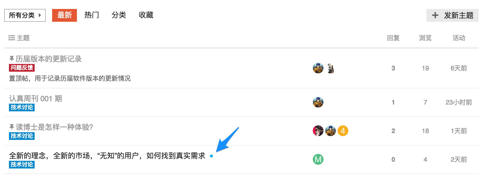

# 认真论坛新用户指南

欢迎新来的小伙伴！作为认真论坛的新用户，我们希望您发现这个网站本身已经很直观且结构清晰，另外这里有一些指导可以帮助您更好的入门：

1. 基本术语
2. 浏览论坛
    * 话题列表
    * 查询谁参加了讨论
1. 导航工具
2. 阅读话题
    * 阅读发帖
    * 回到话题
    * 相关话题
5. 参加对话
    * 回复
    * 草稿
    * 引用
    * 提及
    * 表情符号
    * 根据URL嵌入其他网站的内容
    * 格式编辑
6. 点赞和回帖
7. 通知


---
## 1. 基本术语
以下是一些非常基本的术语，在您使用论坛或阅读本指南时请记住这些术语：

* **话题**：
在有意义的对话中组合在一起的消息集合，其中标题列在类别中，以原始帖子开头，并按时间顺序包括所有回复。

* **发帖**：
话题的每个元素都被称为**帖子**。每个帖子都有自己的作者，如有必要可以移动到不同的话题，甚至成为新话题的开头。

* **原帖（或OP）**：
任何话题的第一篇文章。这是关键，因为它决定了话题的重点，也是标题和标签将链接到的内容。

* **用户**：
未登录用户可以阅读所有帖子，但您需要注册才能创建帖子，添加书签，点赞，添加标记等。目前论坛还没有开放公共注册，所有用户都是通过管理员发送邀请码注册。

## 2.浏览论坛

### 话题列表

默认情况下，论坛主页将显示社区中的所有**最新**对话，但您可以通过多种方式过滤此列表：

 

* **按类别**：默认为“所有类别”，在菜单中，单击“所有类别”，可以选择显示特定类别的列表。

* **按活动级别**：如果您点击“热门”，会话话题将按特定时间段内的大多数活动（视图和回复）的顺序列出。您可以选择是一直这样，还是选择特定时间段，例如季度，月，周或今天。

* **对你来说是什么'新'**：*默认情况下*，新话题是最近2天创建的您未阅读的话题。新话题在话题标题旁边显示一个小蓝点

 

* **什么话题是“未读”**：*默认情况下*，未读话题是您之前打开并阅读 **至少** 4分钟的话题，并且有新帖（回复）。未读话题在蓝色圆圈中显示一个数字，表示该话题中有多少新帖子。

 

### 查看谁参与

有几种方法可以查看谁参与了话题。

在主页上，您将看到以下精选的头像（个人资料图片）：

* 开始话题的用户（总是第一张照片）;
* 一些最活跃的参与者;
* 和谁创建了最新的帖子（通常是最后一张照片）。
* 在某些情况下，第一张照片有蓝色边框或蓝色光环，表示话题的创建用户也是最新回复该话题的用户


当话题有一定的回帖数后，底部的信息框可以看到话题创建时间，回复和阅读次数，以及最频繁参讨论的人。

 

## 3.导航工具

* 右上方的的**三个图标按钮**分别对应搜索，菜单和用户页面。

 

## 4.阅读话题

一个健康的社区需要成员发布新内容，但这项活动并非一切。读者数量和活跃程度也是社区健康状况的真实指标。论坛鼓励和追踪用户的阅读习惯，使社区管理者能够持续改进社区。

### 滑动鼠标浏览

单击话题标题，进入话题，对该话题的回贴是按时间顺序排列。用鼠标滚动浏览，或使用右侧的时间轴滚动条，它还会显示您已阅读的回帖到顶部的距离。在手机屏幕上，点击底部进度条可以展开它，以方便快速跳转到某一回帖或顶部。

 

### 跳回

* 点击话题标题将带您进入话题中的**上次最后阅读的帖子**。要回顶部或底部，请单击回复日期。

 

* 自您上次访问以来，列表上的淡红色线以上的话题是新的或更新的。如果您一直阅读到话题的末尾，则标题将为浅灰色而不是黑色。

 

### 相关话题

如果话题被拆分，将帖子移动到更合适的话题，或者合并两个相关话题，有时会话更清晰。如果移动帖子，则会出现一个链接，允许读者在移动到的任何地方跳转到该评论，并且还会通知发布该评论的人。

 

在话题末尾，您还将看到**相关话题的列表**

 

## 5.参加对话

### 回复

按任意 **回复** 按钮打开浏览器底部的编辑器面板。在撰写回复时，您可以继续阅读（甚至搜索或导航到不同的话题）。

 

要回复话题中的**特定帖子**，请单击每个帖子末尾的灰色**回复**按钮，您的回复将会被链接到该帖子。

* 如果您的回复紧挨着您回复的帖子，则像该话题中的其他帖子，这两张帖子会按时间顺序显示
* 如果您的回复没有紧挨着回复的帖子，那么在您的帖子发布后会发生两件事：
  * 您的帖子将在其标题中包含一个新链接，其中包含一个图像，以显示这是“回复”的内容 - 点击此链接会显示您回复的那张帖子
  * 原始帖子底部显示回复计数 - 单击此链接可显示回复的内容

 

### 草稿

草稿将在您编写时自动保存。如果您最小化编辑器或导航到其他话题，编辑器可能会消失。要打开草稿，请返回您回复的话题，或单击浏览器底部突出显示的栏，编辑器将重新显示您的草稿。

### 引用

要插入引用，请选择要引用的文本，然后点击弹出的引用按钮。注意引用时，没有必要引用整个消息。

 

### 提及

要通知某人您的回复，请提及他们的姓名。**在汉字旁边输入空格**，然后输入`@`开始选择用户名。如果您不知道特定用户名，此搜索还将搜索名称字段。

 

### Emoji

要使用[标准表情符号]（http://www.emoji.codes/），只需**在汉字旁边输入空格**，然后键入`：`按名称匹配，或传统表情符号`;）`

 

或者，单击“更多”以查看可供选择的表情符号的完整列表。

### 链接预览

有关此功能的详细信息，请访问：https：//meta.discourse.org/t/rich-link-previews-with-onebox/98088

要生成链接摘要，请将其粘贴到一行上。链接还可以粘贴到标题字段中。

 

### 格式调整

您的回复可以使用简单的HTML，BBCode或[Markdown]（http://commonmark.org/help/）进行格式化：

```
这是<b>粗体</b>。
这是[b]粗体[/b]。
这是**大胆**。
```

有关更多格式提示，[尝试我们的10分钟教程]（http://commonmark.org/help/tutorial/）。

## 6.点赞和回帖

每个帖子的底部都有操作按钮：

  

* 为了让某人知道您喜欢和赞赏他们的帖子，请使用**喜欢**按钮。

* 通过**链接**按钮获取任何回复或话题的可复制粘贴（永久链接）链接。

* 使用<kbd> ... </kbd>按钮显示更多操作。 **标志**私下让作者或网站工作人员了解问题。 **收藏**以便稍后在您的个人资料页面上找到此帖子。

## 7.通知

当有人**直接与您交谈时**--通过回复您，引用您的帖子，提及您的`@username`，甚至链接到您的帖子，蓝色数字将立即出现在您右侧的个人资料图片上。

当您收到个人信息时，您将在收件箱中收到此信息，并且左侧的个人资料图片上会显示绿色数字。

点击您的个人资料图片，滚动浏览所有**通知**。

 

您可以选择将所有这些通知作为**推送通知**接收到桌面浏览器或Android设备。只需允许网站在获得许可时通过浏览器向您发送通知。

不要担心错过回复 - 您将通过电子邮件发送您离开时收到的任何通知。

如果需要，您也可以在类别或话题级别获得有关网站上发生的其他事情的通知。

### 话题通知
您可以通过每个话题底部和右侧的通知控件更改任何单个话题的通知级别。

  

### 类别通知
也可以按类别设置通知级别。要更改任何这些默认值，请参阅您的用户首选项，或访问类别页面，并使用右侧话题列表上方的通知控件。


