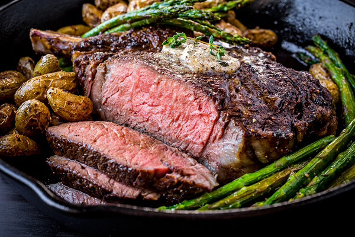

# 为什么我们吃着最好吃的饭，却体质不如人

*[mountainsun1988](http://renzhen1024.com/u/mountainsun1988)*

为什么都说中餐是最好的饭，但是中国人的体质，相对而言，看上去却要瘦弱或者虚胖一些？是中餐需要改进吗？还是只是锻炼需要更加普及一些？

*[306970744](http://renzhen1024.com/u/306970744)*

曾经我记得你还说过，美国人为啥喜欢健身，那是因为太无聊，又不让加班……这话到现在我还耿耿于怀。不知道你现在有什么新的理解没有？

中国人虚胖的问题我以前总以为是体质问题，但是从你和涛哥身上还是能看出来，这个更多的还是和环境还有生活习惯有关系，在中国工作这些年，我感觉中国目前的现状更多的还是像一个饭桌上的国度，不管大事还是小事好像不坐在一起吃个饭就解决不了，长此以往，想要不变成“大腹便便”的油腻男都很难。我的理解：

第一，中国人不想虚胖，但是没办法，在这个社会环境中，他要生活，要加班，要喝酒拉关系来获得更多的经济来源，而通常这种饭局让人笑在脸上，苦在心里，在这种心理状态下吃下去的饭能健康吗？

第二：中国人应该是世界公认的勤劳，为什么不去健身呢？一是穷，二是加班普遍又要操持家事，累。三是懒，比如像我，又穷又懒，身材还保持的好，没办法。

第三，中国菜式太过油腻，好吃不一定健康。比如日本，我媳妇在日本呆了几年，日本人吃的饭量感觉也就够咱们塞牙缝的，这也是日本人为啥都普遍偏瘦。但他们讲究营养搭配，所以日本人普遍长寿。

*[tningjs](http://renzhen1024.com/u/tningjs)*

> You are what you eat

拿非素食者来举例：

从摄入的营养成分来看，中餐偏重碳水，比如主食（米饭或面食）会占整个进餐量的60%以上。相比之下，西餐则偏重蛋白质，西餐中的entree主要成分都是肉食，比如牛排。肌肉生长主要靠蛋白质。

_西餐主食中的牛排_

关于体质的差别，除了摄入的营养成分不同外，如 @306970744 阿壮说所，我觉得还是中美文化上的差异，中国的许多社交都是需要在饭桌上完成，而且还有各种酒桌礼仪，在整个系统之下，加上工作生活的压力，个人很难避免暴饮暴食，长此下去，肥胖肯定是不可避免的。美国整个社会都更偏重于健康生活，同时，工作压力又相对较小，所以大家愿意投入更多时间在运动上面。

 
_面食是中餐的主要成分_

总的而言，我希望在吃中餐时能刻意减少一些碳水的摄入，同时，国人的锻炼确实需要再普及一些。

*[Vivian](http://renzhen1024.com/u/Vivian)*

作为一个爱吃之人，这个问题我要来回答一波。我从出生到22岁，胖了22年，人生的三分之二都在虚胖中度过，个人感觉和北方人爱吃碳水化物分不开，我至今依然爱吃碳水，不爱吃肉，但是在美国这几年，不接触健身也是难的，各种饮食方法我也研究过，比如以蛋白质和脂肪为主的生酮饮食，还有减脂期教练级别的菜谱，发现他们吃碳水/补碳是为了提升新陈代谢，而华人吃碳水是真正的饮食需求！我们偏爱的碳水：白米，白饭，也都是gi值（升血糖指数）非常高的类别，这也是胖和虚的原因。当然了，还有就是中餐的处理过程实在是繁琐，很多非常优质的维生素都在处理的过程中流失了。西餐中蔬菜的主要吃法是生吃，虽然难以下咽，但却保留了维生素和纤维素。