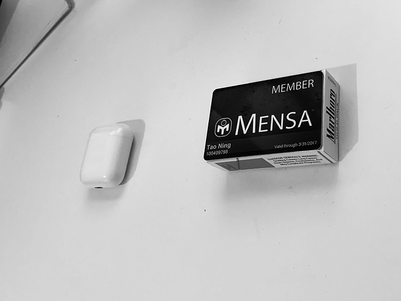

# 美国职场的专业认证

[@mountainsun1988](http://renzhen1024.com/u/mountainsun1988)

请问你所从事的专业证书有哪些？有哪些是你考过或者打算考的？含金量如何？对于专业发展会有哪些影响？

[@tningjs](http://renzhen1024.com/u/tningjs)

这是到美国以后考的唯一一张证书：门萨俱乐部会员（考试$40+一年会费$70）。不过，月刊一次都没有翻过，下线聚会也一次都没有去参加过。当时在为准备面试而做算法题，刷题时，就把它放在电脑旁边，遇到困难的题时，用它提醒自己不要以智商为理由而放弃。:sweat_smile:

据我所知，比较主流的互联网公司对行业认证没有太多的关注。他们更关注候选人过去的项目经验，以及面试时的表现。基本情况是：根据过去经验决定与job的match程度来决定是不是给候选人面试的机会，面试的表现（各位面试官的反馈）来决定是否录取以及以什么等级的职位来录取。

不过，如果能借助考证给自己竖立一个短期的学习目标，从而夯实自己的基础，还是一件非常可行的事情。