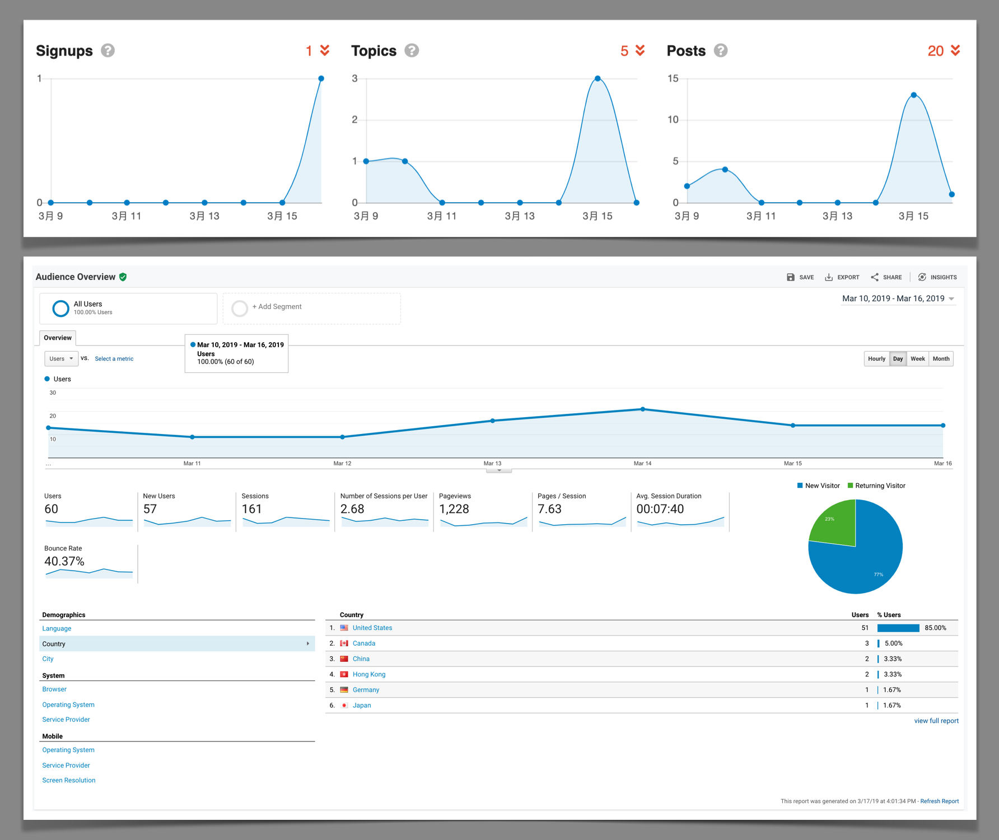

# 完成情况总结

**日期**：Match 11 - 17, 2019

### 本周关键KPI：

 

* 新增话题5个，新增回帖20张。上周团队的UGC不太理想，希望下周可以产出至少两篇较高质量的内容，另外，下周应该继续保持话题和回帖的活跃度。

* 用户总数为60，Session为161，平均每个用户访问2.68次。这个数据比真实偏大，因为相同用户可能使用不同终端访问。这些访问中，有不少都是团队成员自身的访问，等网站开放注册后，可以使用Filter把团队成员的访问Filter out，以保证数据的准确性。

* 用户每次访问平均浏览7.63张帖子，平均每次访问停留时长7分40秒。我们需要进一步思考是否应该提供更简短一点的内容以便于用户阅读，或者坚持做高质量内容，然后去寻找更适合的用户。

### 优化邮件

上周之前，我们发现系统发送的新用户邀请邮件不少都被识别为Spam，这个问题在未来会影响新增用户数量。所以上周 @Allen 重点研究了如何防止这类情况的发生。我们根据 [Spammyness Score](https://www.mail-tester.com/) 提供的报告，对系统发送的邮件进行了一系列优化。

同时，我们也统计了系统中注册用户所使用的邮箱种类，并且对每个邮箱都手工注册了新账号。进行测试，改进后，系统邮件能顺利通过所有邮箱的Spam filter，未来，如果有新用户使用不同的注册邮箱，我们会继续按照此方法进行测试。同时，由于mail filter rules一直在动态变化，所以，我们决定每两周就会往这些测试邮箱发送邀请，进行测试。下面是本次测试的结果：

* Gmail => Lands in "promotion" tab
* Hotmail => Lands in "others" tab
* Outlook => Lands in "others" tab
* QQ Mail => Lands in inbox

### 通过邮件回复

根据用户 @mountainsun1988 提出的建议，如果关注的话题有更新，用户在收到系统的邮件通知后，现在可以直接通过回复邮件来回帖和发帖，而不用再登录到网站上进行发帖的操作。提供这项功能会在一定程度上减少网站的访问量，但是因为方便了用户发帖，所以会增加回帖数量。我们认为，做出这个Compromise是有必要的。

 

### HTTP到HTTPS的跳转

上周之前，用户通过域名（renzhen1024.com）直接访问时，浏览器默认的Protocol是HTTP。这样会造成浏览器提示用户“该网址是不安全链接”。上周我们通过对Server的设置，将所有的访问都跳转为HTTPS，并且修复了因为跳转造成的一些Bug：

 

**Author**: [Altair](http://renzhen1024.com/u/Altair)